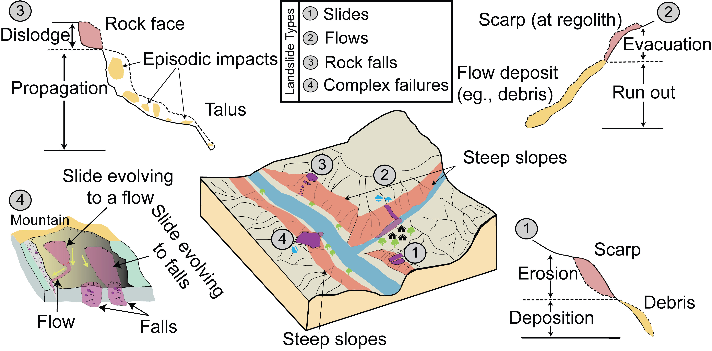

# Uncovering landslide failure types

"Sample Feature Engineered Data" contains the arrays that were generated using TDA. The data can be used to train any ML/DL model. 

### Schematic outlook of failure movements

We also release the documentation of two inventories from Fan et al. (2019) which are now documented with failure-type information.
